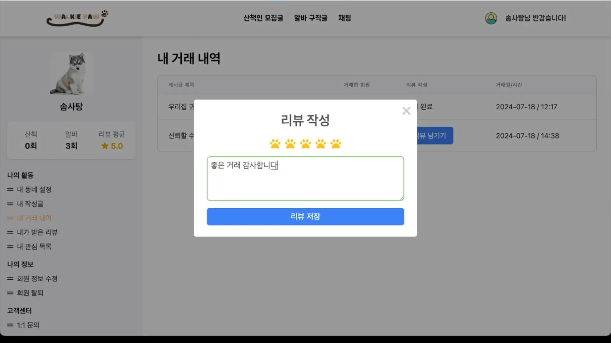
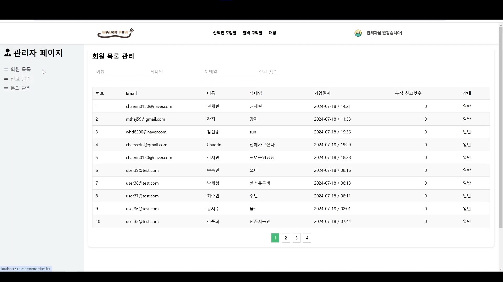
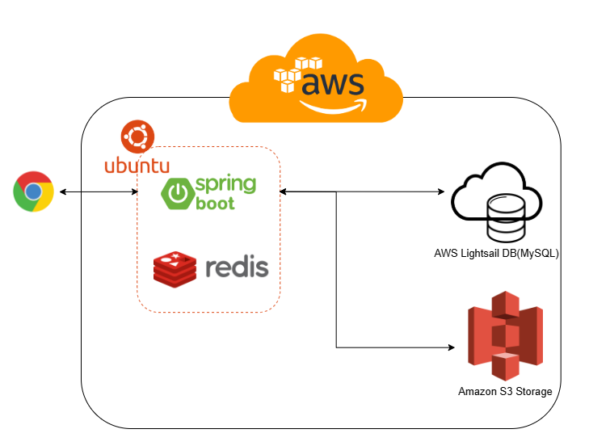
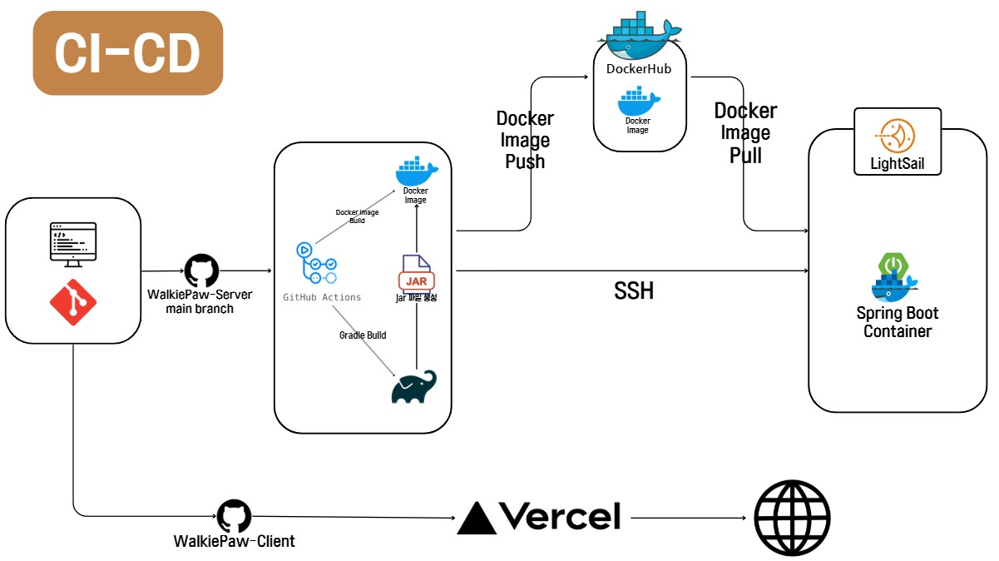

## 서비스 개요

### 서비스 명

Walkie Paw 🐾

### 개발 기간

2024.06.10 ~ 2024.07.19

## 프로젝트 소개

반려동물은 단순한 가족 구성원 이상의 의미를 지닙니다. 그러나 바쁜 생활 패턴으로 인해 반려견 산책은 종종 소홀히 되기 쉽습니다. WalkiePaw는 반려견 산책 전문 서비스를 제공하여 이 문제를 해결하고자 합니다.

WalkiePaw를 통해 견주들은 신뢰할 수 있는 산책인을 쉽게 찾을 수 있습니다. 채팅을 통해 산책인과 직접 대화하며 자세한 사항을 조율해 보세요.
또한 산책인 프로필과 평가 시스템을 갖추고 있어, 견주들이 안심하고 산책인을 선택할 수 있습니다.

WalkiePaw를 통해 반려견 산책은 더 이상 부담이 되지 않을 것입니다. 반려견과 가족 모두가 행복해질 수 있는 기회를 만들어보세요!

## 주요 기능 소개

### 반려견을 산책시켜 줄 산책인을 모집해 보세요.

### 채팅을 통해 직접 산책인과 자세한 사항을 조율할 수 있습니다.

### 리뷰 시스템을 통해 신뢰할 수 있는 산책인을 모집해 보세요.

### 관리자 페이지를 제공하여 관리자는 사이트를 관리할 수 있습니다.

## System Architecture

## CI/CD

## 기술 스택

### Backend

### Frontend

### Communication

### Tools

## 팀원 소개

### 프론트엔드
- [박세진](https://github.com/SejinPrk)
- [권채린](https://github.com/chaexrin)
- [김현준](https://github.com/MtheJ59)

### 백엔드
- [손창우](https://github.com/woo-be)
- [김선종](https://github.com/sunjong0214)

